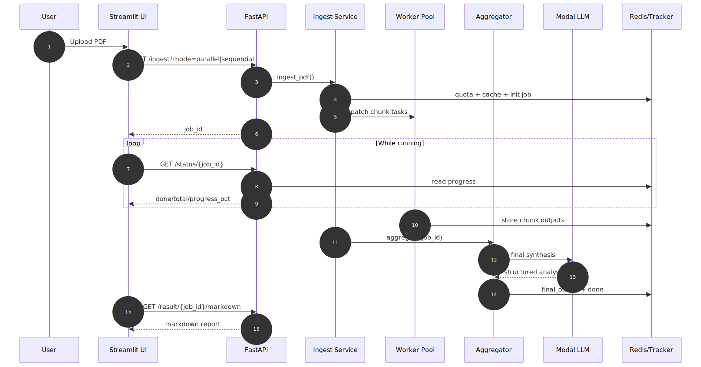

# 🌟 PDF Review Assistant - Asynchronous Processing Pipeline

[](https://www.python.org/downloads/)
[](https://opensource.org/licenses/MIT)

A complete end-to-end pipeline for processing, parsing, and reviewing large PDF documents asynchronously using Modal, FastAPI, Streamlit, and vLLM.

## 🧾 Project Description

Built a highly scalable, asynchronous PDF review pipeline that breaks down large documents, processes them in parallel chunks, and aggregates intelligence using LLMs.

- **Document Processing:** Efficient extraction, cleaning, and chunking of massive PDFs
- **Asynchronous Workloads:** Distributed worker pools via Modal for handling heavy context sizes seamlessly
- **Intelligent Synthesis:** Retrieval-augmented chunk processing and final markdown report aggregation via vLLM
- **Interactive UI:** Streamlit frontend for uploading documents and monitoring live extraction/processing progress

---

## 📋 Table of Contents

- [Features](#-features)
- [Project Structure](#-project-structure)
- [System Architecture](#-system-architecture)
- [Data Flow](#-data-flow)
- [Deployment Topology](#-deployment-topology)
- [Quick Start](#-quick-start)
- [Pipeline Overview](#-pipeline-overview)

---

## ✨ Features

- **🔥 High Performance**: Asynchronous chunk processing and worker orchestration
- **📊 Real-Time Progress**: Live tracking of chunk tasks via FastAPI and Redis state management
- **🎯 Intelligent Chunking**: Context-aware retrieval and processing via local/remote embeddings
- **☁️ Cloud & Local Scale**: Local testing environment with simple lift-and-shift to Modal Cloud
- **🚀 Easy Deployment**: Ready-to-use API backend and Streamlit frontend

---

## 📁 Project Structure

```text
PdfReviw/
├── 📂 api/                       # API Layer
│   ├── main.py                   # FastAPI application
│   ├── chunker.py                # PDF chunking logic
│   ├── retrieval.py              # Embedding & retrieval tools
│   ├── tracker.py                # Job progress state management
│   └── services/                 # Business logic
│       └── ingest_service.py     # PDF ingestion handlers
│
├── 📂 docs/                      # Documentation and Architecture
│   ├── diagrams/                 # Mermaid architecture diagrams
│   └── ...                       # Pipeline specs and setups
│
├── 📂 frontend/                  # UI Layer
│   └── app.py                    # Streamlit web application
│
├── 📂 Modal/                     # Cloud compute layer
│   ├── aggregator.py             # Synthesis and summarization
│   ├── llm_client.py             # Interfaces to vLLM
│   ├── vllm_server.py            # Model serving
│   └── worker.py                 # Distributed processing workers
│
├── 📂 scripts/                   # Utilites
│   └── production_preflight.py   # System checks before deploy
│
├── 📂 tests/                     # Test Suites
│   ├── benchmark.py              # Performance tests
│   ├── phase1_smoke.py           # Smoke testing
│   └── test_api_contract.py      # Contract testing
│
└── 📜 requirements.txt           # Python dependencies
```

---

## 🏗️ System Architecture

Our system splits the workload efficiently between the presentation layer, the API orchestration, processing layers, and scalable LLM intelligence modules.



Diagram source: `docs/diagrams/system-architecture.mmd`

---

## 🔄 Data Flow

The asynchronous data flow guarantees a non-blocking UI experience. The system tracks chunks processing in parallel via Redis, and returns the accumulated results once the Modal tasks finish.



Diagram source: `docs/diagrams/data-flow.mmd`

---

## 🌐 Deployment Topology

The system can seamlessly distribute work from local instances to the Modal cloud, while sharing standard data layers.



Diagram source: `docs/diagrams/deployment-topology.mmd`

---

## ⚡ Quick Start

1) Install dependencies

```bash
pip install -r requirements.txt
```

2) Environment setup (if not using Modal entirely implicitly)

Set up your `.env` or Modal tokens depending on your deployment. Refer to `docs/modal_credentials_setup.md` for specific Modal setup requirements.

3) Start the FastAPI Backend

```bash
uvicorn api.main:app --host 0.0.0.0 --port 8010 --reload
```

4) Start the Streamlit Frontend

```bash
streamlit run frontend/app.py
```

---

## 📊 Pipeline Overview

1. **PDF Ingestion**: Documents are ingested and immediately partitioned using internal chunking logic (`api/chunker.py`).
2. **Task Dispatching**: A unique `job_id` is created, and chunk tasks are submitted to backend workers.
3. **LLM Reviews**: Specialized models (served via vLLM) process each chunk, analyzing content in parallel.
4. **Aggregation**: Once chunks are processed, `aggregator.py` collects the responses and stitches together a coherent Markdown review report.
5. **Real-time Updates**: `tracker.py` maintains detailed stats (chunks completed vs pending), accessed seamlessly by the frontend polling mechanism.
